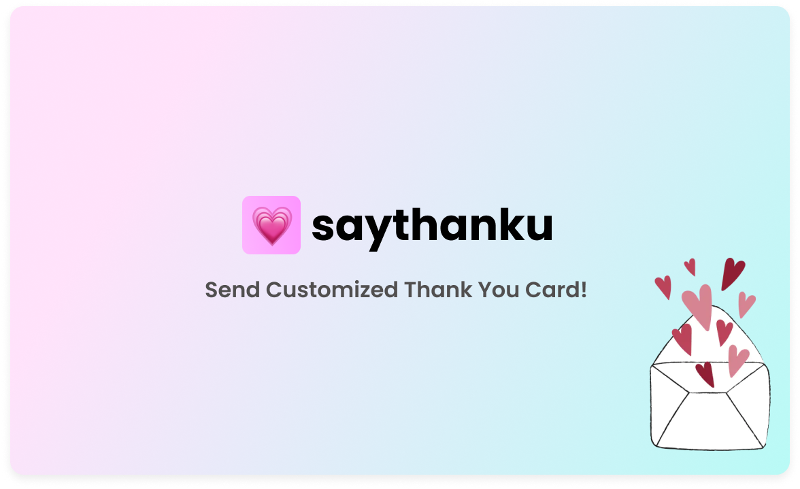
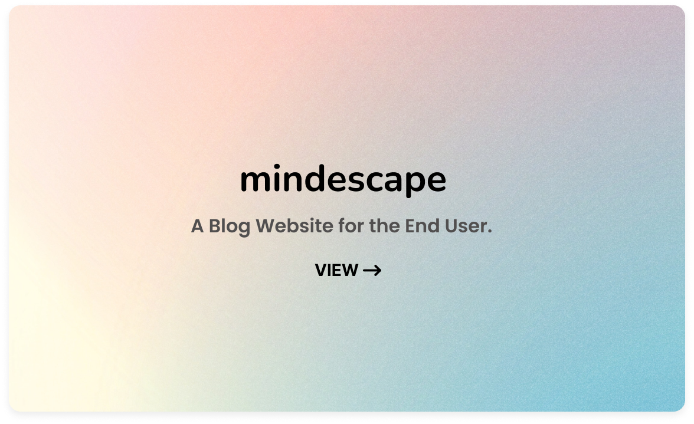
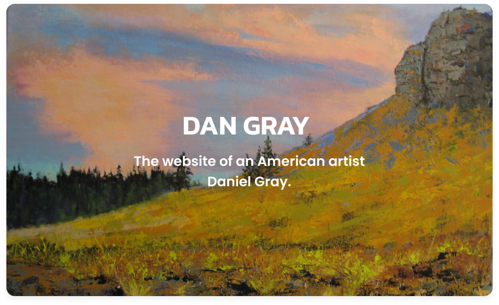
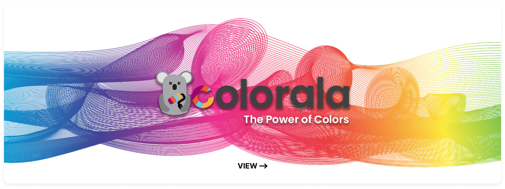

# 👋 Hey I'm Maciej

<b>I learn, plan, design & code ⌨️.</b> 

I'm an avid learner, meticulous planner, passionate designer, and proficient coder. The relentless pursuit of growth and mastery in programming fuels my every step. There's no other place I see myself, as coding exhilarates me on multiple levels. It shatters boundaries and grants us the power to craft exquisite, impactful products. With each line of code, I believe in the potential to reshape the world as we know it.

## Tech Stack

  

## Selected Current Projects

  
  

  
  

  

## Beyond Coding

- I enjoy cooking with my wife 🍲
- I care for my bonsai trees 🌳
- I play and watch football ⚽
- I am crazy with my 2 PUGS 🧸🧸🧡

  

## Links

🔗 Personal Website: [maciejkuran.com](https://maciejkuran.com/)
🔗 LinkedIn: [/maciej-kuran-janowski](https://www.linkedin.com/in/maciej-kuran-janowski/)

## Contact

📫 maciejkuran@gmail.com
