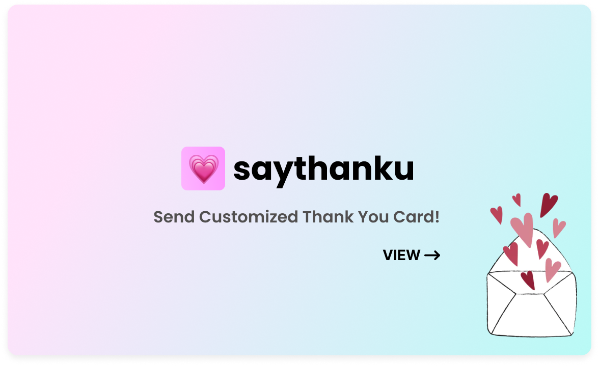

# 👋 Hey I'm Maciej

<b>I learn, plan, design & code ⌨️.</b> The prospect of growing and becoming a better programmer drives me in life. I don't see myself anywhere else. Coding is exciting to me for many reasons. Programming sets no boundaries. We have an opportunity to create beautiful and valuable products. Programmers can change the world with lines of code.

## Tech Stack

  

## Selected Current Projects

  
  

  
  

  

## Beyond Coding

- I enjoy cooking with my wife 🍲
- I care for my bonsai trees 🌳
- I play and watch football ⚽
- I am crazy with my 2 PUGS 🧸🧸🧡

  

## Links

🔗 Personal Website: [maciejkuran.com](https://maciejkuran.com/)
🔗 LinkedIn: [/maciej-kuran-janowski](https://www.linkedin.com/in/maciej-kuran-janowski/)

## Contact

📫 maciejkuran@gmail.com
